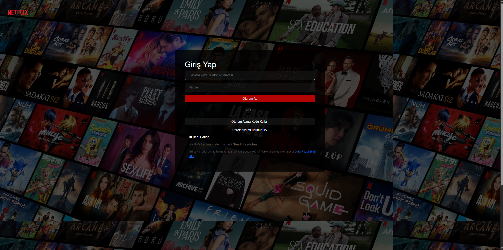

# 🎬 Netflix Clone  
*Yapım Tarihi: 2022 - 2023*

Bu proje, **Netflix** ana sayfası ve giriş ekranının birebir klonudur.  
HTML, CSS ve Bootstrap kullanılarak tasarlanmıştır.

---

## 📝 Proje Hakkında

Bu proje, **Neos Yazılım Akademi** kursu kapsamında, **2022 - 2023** yıllarında geliştirilmiştir.  
Amaç, popüler bir streaming servisinin ön yüz tasarımını uygulamalı öğrenmek ve pratik yapmaktır.

---

## 🚀 Teknolojiler

- HTML5  
- CSS3  
- Bootstrap 5  
- JavaScript (Accordion ve interaktif elemanlar için)

---

## 📸 Ekran Görüntüleri

  
  
  

---

## 💻 Kullanım

Projeyi çalıştırmak için:

1. Depoyu klonlayın veya ZIP olarak indirin.  
2. `netflix.html` ve `login.html` dosyalarını tarayıcıda açın.  
3. `style.css` ve `img` klasörünün aynı dizinde olduğundan emin olun.  

---

## ⚠️ Lisans

Bu proje eğitim amaçlıdır ve ticari kullanım için değildir.

---

## 📬 İletişim

Ahmet Mert ÇETİNKAYA  
[GitHub Profili](https://github.com/ahmet-mert-cetinkaya)  
E-posta: ahmet_mert_cetinkaya@outlook.com.tr

---

*Teşekkürler! 🙌*
